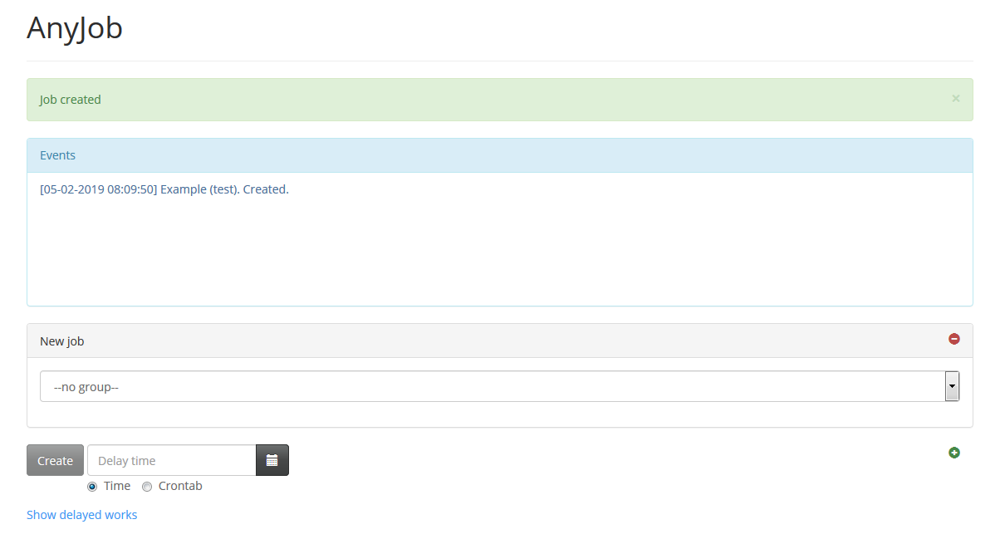
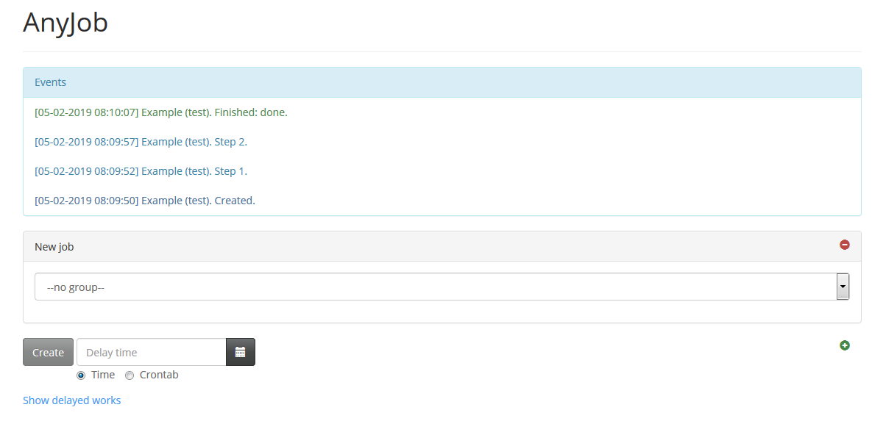

# AnyJob

Program system used to execute arbitrary jobs on some set of linux nodes and observe how they run.
By now it is in beta stage and was used in production for already quite a long time, so project
can be considered relatively solid.

AnyJob can be used to simplify automation inside your distributed project or to quickly perform some
frequent administrative tasks and request information from the single entry point.

For data storage and communication between different system parts *redis* server is used.

As main programming platform *perl* was choosed. In theory you can develop job modules in any language
you want because workers are run as separate executables but that will require additional support
for each such case.

### Goals

The following goals were pursued during system development:

- Maximal configurability, ability to run actually *any* jobs with minimal dependencies on environment and conditions.

- Adding and deployment of new jobs should be as simple as possible.

- Maximal flexibility of job executioning, ability to create set of interrelated jobs which will know
about each other and act in a coordinated manner.

- Maximal flexibility of observing how jobs are run, arbitrary ways to notify end users about it.

- Maximal simplicity of job starting and receiving some result using several methods.

### Basic principles and concept

**Job** is entity which must be run on some node. It has *type*, *parameters* and *properties*. All jobs are created
by *creator* component and allowed to unite into interrelated group called *jobset*. Parameters and properties have
similar structure (it's just 'name-value' pairs), but allowed parameters are individual for each job type and
properties are global for the whole system. Parameters are used by *worker* component during job execution, and
properties are used by AnyJob system itself and by observers too.

**Event** is entity which holds information about some movement in job or jobset execution. Events are sent to
*observers*.

**Node** is some physical or virtual server where jobs are run.

**Creator** is a separate component which creates new jobs and jobsets. It can contain arbitrary number of
addons providing different creation methods. By now it supports next ones:
- Using console application *bin/anyjobc.pl*. Just feed to it job type, nodes separated by comma, parameters and
properties in format 'name=value'.
- Using web application. It is started by bash script 'rc.anyjobc' and actually provides two creation ways:
using browser-side application and using slack application (https://slack.com/).

In addition to actual creating creator supports another interesting feature: observing created jobs. Unlike
individual observers creator observes just the jobs it created and can send notifications directly to users who
created them. That embedded into creator observer is called *private* observer.

**Builder** is a inner component of creator which is used to build jobs in several steps.

**Daemon** is a separate component which is a heart of the system, and there are one or more controllers which are run
inside. Daemon is started on each node by bash script 'rc.anyjobd'. There should be *global* controller on one
choosed node which controls entire system including jobsets, and *regular* controller on every node where jobs are
supposed to be run. 

Daemon may launch additional processes, in particular worker daemons and copies of itself which are used to serve
special "isolated" controllers.

**Observer** is a controller subtype which observes events sent directly to it and it runs inside daemon. Each observer
should exist only in one copy in the whole system. On receiving event observer usually generates some notification
using provided template and sends it to one or more configured recipients (i.e. by mail, into slack channel or just
to log file).

Observers can be configured as isolated ones which are launched in separated processes to not disturb other controllers
operation.

**Worker** is a separate component which performs one specific job. Two types of workers are supported: external
executable (by default 'bin/anyjobw.pl') and worker daemon (by default 'bin/anyjobwd.pl'). Both of them are launched
by daemon automatically, but the first one is executed for each job individually and the second is working all
the time retrieving jobs from special queue. 

Each job type should have its own module (but that's not required: one module could support several similar job
types). Module class object is created before job execution and destroyed right after that.
To perform correctly worker should notify AnyJob about job progress, completion and also probably watch for
jobset state if it needs coordinated work. Convenient methods for every such use case are included in base class
'AnyJob::Worker::Job::Base' which all job modules should extend. 

Optionally creating of special context object is supported which has meaning when you launch jobs inside worker
daemons. Context object is created right after daemon start and exists all its working time, so you can use it
to manage shared long-term resources such as database connections and so on.

**Semaphore** is a special entity used to wrap job or jobset execution into special section which can be entered
only limited number of times. So using semaphores one could define that some job or jobset in any specific
moment in time can be executed only by limited number of workers.

**Work** is entity containing arbitrary collection of jobs and jobsets.

**Delayed work** is entity containing collection of arbitrary jobs and jobsets with information about
time when to execute them.

### Before using

To use AnyJob you need:

- select interconnected server nodes where you want to run jobs, choose names for them (you can use host names
for simplicity).

- install AnyJob on them (read [doc/install.txt](doc/install.txt) for details about prerequisites and installation
steps).

- determine jobs you want to run and create appropriate *perl* modules for them. Optionally you can also create
context module. You are allowed to use other language but for now only for *perl* convenient environment and base
classes (*AnyJob::Worker::Job::Base* and *AnyJob::Worker::Context::Base*) are available.

- configure AnyJob on each node. Read [doc/config.txt](doc/config.txt) and other documentation files for details.

- to create jobs and manage delayed works you can use console utility *bin/anyjobc.pl* or separate web application.
Slack application (https://slack.com) is also available as part of that web application.

- to understand how all works it is extremely recommended to read all documentation from the *doc* directory.
   - [doc/install.txt](doc/install.txt) - prerequisites and installation steps.
   - [doc/env.txt](doc/env.txt) - environment variables.
   - [doc/config.txt](doc/config.txt) - configuration.
   - [doc/access.txt](doc/access.txt) - accesses to jobs, jobs nodes, jobs parameters and jobs properties.
   - [doc/event.txt](doc/event.txt) - events and observers.
   - [doc/props.txt](doc/props.txt) - properties of jobs and jobsets.
   - [doc/opts.txt](doc/opts.txt) - options of delay operations.
   - [doc/redis.txt](doc/redis.txt) - keys used in *redis*.
   - [doc/semaphore.txt](doc/semaphore.txt) - semaphores.
   - [doc/delay.txt](doc/delay.txt) - delayed works.

If you plan to extend AnyJob, it is recommended to study code and comments. At least you should examine
*AnyJob::Worker::Job::Base* and *AnyJob::Worker::Job::Example* to understand how to correctly write new job modules.
And *AnyJob::Worker::Context::Base* too if you suppose to run jobs inside worker daemons. 

### Browser web application screenshots

**Beginning:**

**Job group and type are selected:**

**Job is created:**

**Job is finished:**

**Delayed works:**

**Delayed work update:**

### Limitations

1. Full job support is implemented only for *perl* environment. For all other platforms writing specific
executable, classes etc. is required.

2. There are no automatic tests implemented, all testing is performed only by hand.

3. Only *Redis* is used both for data storage and for message queuing.

4. All messages displayed by applications are only in english.
