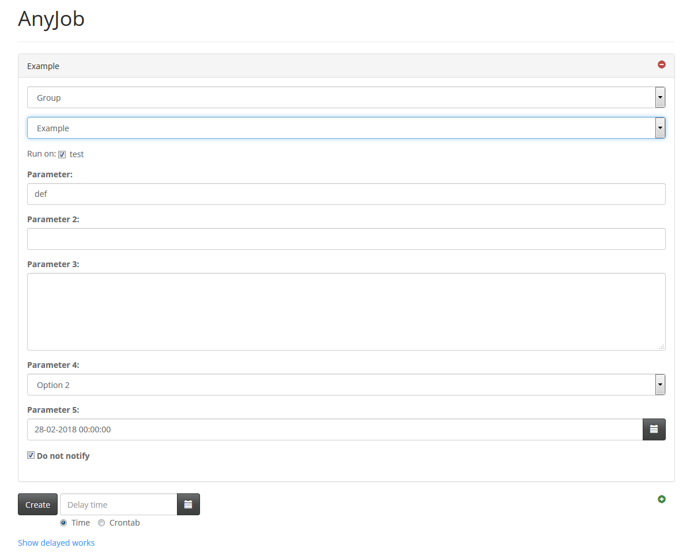
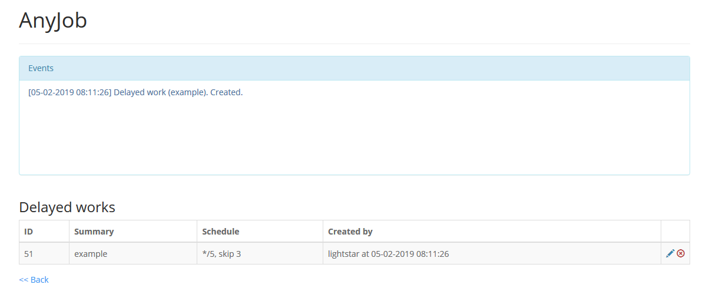
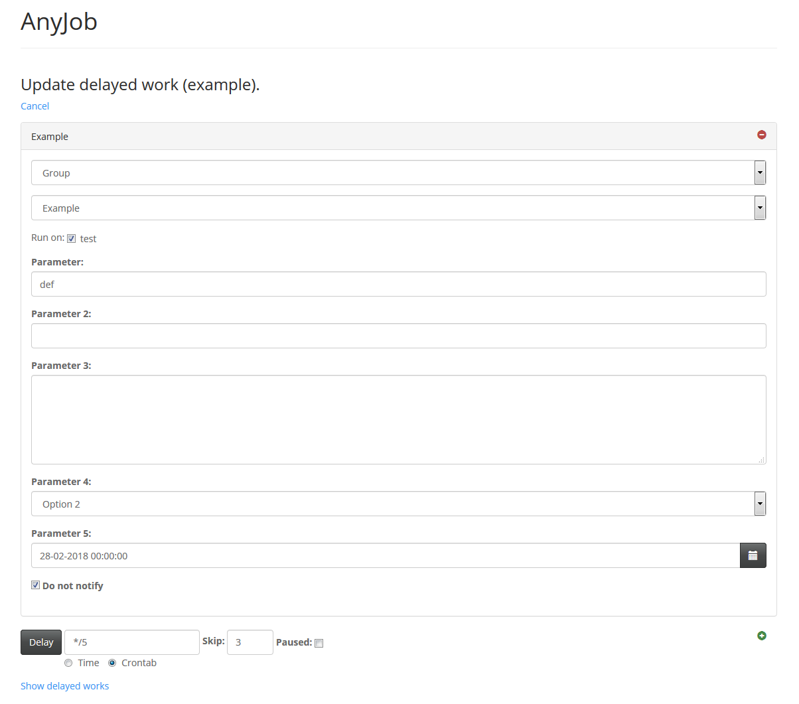

# AnyJob

_This is russian version of README file. To read in english go to [README.en.md](README.en.md)._

Система, позволяющая запускать произвольные задачи на некотором множестве узлов linux и отслеживать
их выполнение. На данном этапе находится в состоянии *пре-бета* и уже довольно долгое время используется
в продакшне, так что можно считать проект относительно зрелым.

AnyJob может применяться как для упрощения автоматизации внутри вашего распределенного проекта, так и для
возможности быстро производить какие-либо административные действия или получать самую разную информацию из единой
отправной точки.

В качестве хранилища данных, а также средства коммуникации между различными частями системы,
используется *redis*.

Основной программной платформой выбран *perl*. Теоретически возможно написание кода задач и на любых других языках,
т.к. запускаются они вызовом внешнего исполняемого файла, но для этого потребуется дополнительная поддержка для каждого
такого случая.

### Цели

При проектировании данной системы преследовались следующие цели:

- Максимальная конфигурируемость, возможность запускать действительно *любые* задачи с минимальными
зависимостями от окружения и условий.

- Как можно более простое добавление и развертывание новых задач.

- Максимальная гибкость в выполнении задач, возможность создавать набор взаимосвязанных задач, которые бы
"знали" друг о друге и действовали координированно.

- Максимальная гибкость в отслеживании выполнения задач, произвольное количество способов оповещений
об этом выполнении.

- Максимально простой запуск задач с получением некоторого результата, используя несколько разных способов.

### Основные принципы и понятия

**Задача (job)** - сущность, олицетворяющая некую работу, которую нужно выполнить на конкретном узле. Задача имеет
тип (*type*), набор параметров (*params*) и свойств (*props*). Все они создаются компонентом создателя (*creator*)
и могут объединяться во взаимосвязанные группы или наборы (*jobset*). Параметры и свойства имеют одинаковую структуру
(это список вида 'имя-значение'), и разница лишь в том, что набор возможных параметров индивидуален для
каждого типа задач, а набор свойств глобален для системы в целом. Параметры используются при непосредственном
выполнении задач компонентом рабочего (*worker*), а свойства - внутри самой системы AnyJob, а также
в наблюдателях (*observer*).

**Событие (event)** - сущность, олицетворяющая информацию об изменении, произошедшем с задачей или набором задач
в процессе выполнения. События отправляются наблюдателям (*observer*).

**Узел (node)** - сущность, олицетворяющая физический или виртуальный сервер, на котором могут выполняться задачи.

**Создатель (creator)** - обособленный компонент, который предназначен для создания новых задач
и наборов задач. Может содержать произвольное количество дополнений, предоставляющих новые способы создания.
На данном этапе поддерживаются следующие способы:
- С помощью консольного приложения *bin/anyjobc.pl*. Просто передайте ему тип задачи, список узлов
через запятую, а также набор параметров и свойств в формате 'имя=значение'.
- С помощью веб-приложения. Веб-приложение запускается bash-скриптом *rc.anyjobc* и по сути
предоставляет два способа создания: с помощью браузерного веб-приложения и с помощью slack-приложения
(https://slack.com/).

Помимо непосредственно создания, создатель поддерживает еще одну интересную возможность: наблюдение
за созданными задачами. В отличие от обособленных наблюдателей, создатель наблюдает именно за теми
задачами, которые он создал, и имеет возможность отправлять оповещения о них непосредственно
тем пользователям, которые их создали. Такой наблюдатель, встроенный в создатель, называется *частным
(private)*.

**Строитель (builder)** - внутренний компонент создателя, используемый для построения задачи за несколько шагов.

**Демон (daemon)** - обособленный компонент, который является сердцем системы, и внутри него работают
один или несколько контроллеров (*controller*). Демон запускается на всех узлах с помощью bash-скрипта
*rc.anyjobd*. На одном из узлов должен быть запущен *глобальный (global)* контроллер, который осуществляет
управление системой в целом, в частности наборами задач, а на всех, где планируется запускать задачи -
*рядовой (regular)* контроллер.

Демон может запускать дополнительные процессы, в частности рабочие-демоны и копии себя, обслуживающие специальные
"изолированные" контроллеры.

**Наблюдатель (observer)** - подвид контроллера, который осуществляет наблюдение за отправленными
непосредственно ему событиями. Каждый наблюдатель должен быть запущен лишь в одном экземпляре
в рамках системы. Работает внутри демона. При получении события наблюдатель как правило генерирует
некое оповещение с помощью предоставленного ему шаблона, и направляет его сконфигурированному получателю
или получателям (например, по почте, в канал slack или просто в лог).

Наблюдатели могут быть настроены как изолированные. Тогда они запускаются в отдельном процессе, чтобы
не мешать остальным контроллерам демона.

**Рабочий (worker)** - обособленный компонент, который занимается выполнением одной конкретной задачи.
Поддерживается два вида такого компонента: внешний исполняемый файл (по умолчанию, *bin/anyjobw.pl*)
и рабочий-демон (по умолчанию, *bin/anyjobwd.pl*). И те, и другие автоматически запускаются демоном,
разница лишь в том, что первый запускается отдельно для каждой задачи, а второй работает все время
и извлекает задачи на выполнение из специальной очереди.

Для каждой задачи должен быть реализован отдельный модуль (хотя допускается и выполнение одним модулем
нескольких типов похожих задач). Объект класса из этого модуля создается при запуске задачи на выполнение и
уничтожается по ее завершении. Для корректного выполнения рабочий должен оповещать AnyJob о
прогрессе задачи и ее завершении, а также, вероятно, следить за состоянием набора задач для координированной
работы. Удобные методы для этого предоставляются базовым классом *AnyJob::Worker::Job::Base*, от которого
и должны наследоваться все модули задач.

Также опционально поддерживается и создание специального объекта контекста, смысл в котором появляется
при запуске задач внутри рабочего-демона. Контекст создается сразу при запуске демона и существует все
время его работы, так что в нем можно управлять общими долговременными ресурсами вроде подключений к
базе данных и т.п.

**Семафор (semaphore)** - специальный объект, позволяющий обернуть выполнение задачи или набора задач
в особую секцию, в которую разрешается входить лишь ограниченное количество раз. Так, с помощью семафоров
можно указать, что определенная задача или набор задач в каждый конкретный момент времени может
выполняться лишь ограниченным количеством рабочих.

**Работа (work)** - объект, хранящий в себе массив произвольных задач и наборов задач. 

**Отложенная работа (delayed work)** - объект, хранящий в себе массив произвольных задач
и наборов задач, а также информацию о том времени, когда их нужно запускать на выполнение. 

### Перед началом использования

Для того, чтобы использовать AnyJob, вам нужно:

- выделить взаимосвязанные серверные узлы, на которых вы бы хотели выполнять задачи, определить
для них краткое имя (для простоты можно использовать имя хоста).

- установить на них AnyJob (читайте [doc/install.txt](doc/install.txt) для подробной информации
о требованиях и этапах установки, информация приведена на английском языке).

- определить задачи, которые вы хотите выполнять, и создать для них соответствующие модули *perl*.
Также опционально можно реализовать модуль контекста. Допустимо использовать и другой язык, но на
данном этапе только для *perl* доступно удобное окружение и базовые классы (*AnyJob::Worker::Job::Base* и
*AnyJob::Worker::Context::Base*).

- сконфигурировать AnyJob на каждом узле. Подробности читайте в [doc/config.txt](doc/config.txt) и
других смежных файлах.

- для создания задач и управления отложенными работами можно использовать как консольную утилиту
*bin/anyjobc.pl*, так и обособленное веб-приложение. Внутри веб-приложения также доступно и приложение
для slack (https://slack.com/).

- для понимания того, как все работает, крайне рекомендуется изучить документацию (на английском языке)
из директории *doc*.
   - [doc/install.txt](doc/install.txt) - требования и шаги установки.
   - [doc/env.txt](doc/env.txt) - переменные окружения.
   - [doc/config.txt](doc/config.txt) - конфигурация.
   - [doc/access.txt](doc/access.txt) - доступы к задачам, а также к узлам, параметрам и свойствам задач.
   - [doc/event.txt](doc/event.txt) - события и наблюдатели.
   - [doc/props.txt](doc/props.txt) - свойства (*properties*) задач и наборов задач.
   - [doc/opts.txt](doc/opts.txt) - опции (*options*) операций с отложенными работами.
   - [doc/redis.txt](doc/redis.txt) - используемые ключи *redis*.
   - [doc/semaphore.txt](doc/semaphore.txt) - семафоры.
   - [doc/delay.txt](doc/delay.txt) - отложенные работы.

Если вы планируете расширять систему, то рекомендуется изучить код и комментарии к нему. Для понимания того как
правильно писать новые модули задач, следует изучить хотя бы *AnyJob::Worker::Job::Base* и
*AnyJob::Worker::Job::Example*, а также *AnyJob::Worker::Context::Base*, если вы предполагаете запускать задачи
внутри рабочего-демона.

### Скриншоты браузерного веб-приложения

**Начало работы:**

**Группа и тип задачи выбраны:**

**Задача создана:**

**Задача выполнена:**

**Отложенные работы:**

**Изменение отложенной работы:**

### Ограничения и планы на дальнейшее развитие

1. Полная поддержка выполнения задач сейчас реализована только в среде *perl*. Для возможных других платформ
требуется написание своего исполняемого файла, классов и т.п. Впрочем, пока что это не планируется.

2. Каких-либо автоматических тестов сейчас нет, тестирование осуществляется только вручную. Было бы неплохо
все-таки их написать, но это не приоритетная задача.

3. Сейчас создавать задачи можно только напрямую с их реальным типом, параметрами и свойствами.
Было бы неплохо при создании указывать некий абстрактный тип и параметры, которые уже в создателе
по каким-то правилам преобразовывались бы в реальную задачу или даже набор задач. Например, тогда можно будет
создать задачу 'restart_all', которая вызовет создание набора задач 'restart' на всех узлах, возможно
с еще какими-то дополнительными задачами.

4. Сейчас как для хранилища данных, так и для очередей сообщений используется *redis*. И хотя он неплохо
справляется, стоит абстрагироваться от него с помощью отдельных модулей, чтобы в будущем упростить переход
на какие-либо другие механизмы для этого.

5. Стоит реализовать ряд модулей-рабочих общего пользования 'из коробки'. Например, такой, который
выполнял бы произвольную программу и перехватывал ее ввод-вывод. Или запускал бы определенный метод
в каком-либо модуле perl с определенными параметрами и т.п.

6. Все сообщения, отображаемые приложениями, сейчас только на английском языке. Неплохо бы сделать
интернационализацию, чтобы были переводы всех фраз, и была возможность переключаться между разными языками
(в первую очередь, между английским и русским, конечно же).

7. Сейчас приложение slack требует явного указания типа задачи и списка узлов в тексте команды. Стоит добавить
возможность указывать группу, тип задачи и список узлов с помощью диалогов (правда, придется их показывать несколько
по очереди).

8. В веб-приложение стоит добавить поддержку ссылок, которые бы вели на частично созданную задачу, чтобы упростить
их создание.
